# VRVis XR Twin - Topic Tree / Feature Overview

Diese Darstellung zeigt die wichtigsten Themen des Projekts aus der Vogelperspektive.

---

## Topic Tree

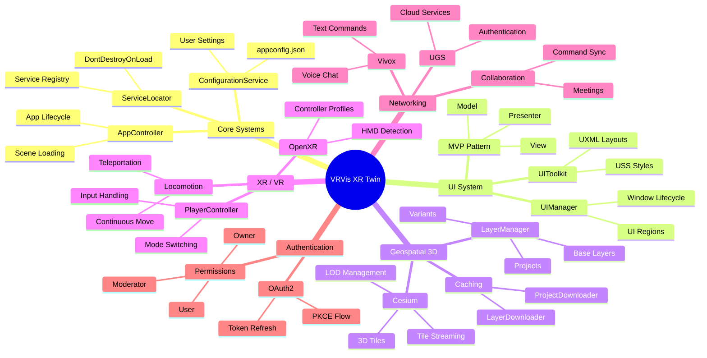


---


## Hierarchical Flowchart

```mermaid
%%{init: {'theme': 'dark', 'themeVariables': { 'primaryColor': '#4A90D9', 'primaryTextColor': '#fff'}}}%%
flowchart TB
    VRVis["<b>VRVis XR Twin</b><br/>Collaborative XR Digital Twin"]

    VRVis --> CORE
    VRVis --> UI
    VRVis --> GEO
    VRVis --> XR
    VRVis --> NET
    VRVis --> AUTH

    subgraph CORE["CORE SYSTEMS"]
        C1["<b>ServiceLocator</b>"]
        C2["<b>AppController</b>"]
        C3["<b>Configuration</b>"]
        C1a["Service Registry"]
        C2a["Scene Loading"]
        C3a["appconfig.json"]
    end

    subgraph UI["UI SYSTEM"]
        U1["<b>UIManager</b>"]
        U2["<b>MVP Pattern</b>"]
        U3["<b>UIToolkit</b>"]
        U1a["Window Lifecycle"]
        U2a["Presenter/View/Model"]
        U3a["UXML/USS"]
    end

    subgraph GEO["GEOSPATIAL"]
        G1["<b>LayerManager</b>"]
        G2["<b>Cesium</b>"]
        G3["<b>Caching</b>"]
        G1a["Projects & Variants"]
        G2a["3D Tile Streaming"]
        G3a["Offline Support"]
    end

    subgraph XR["XR / VR"]
        X1["<b>PlayerController</b>"]
        X2["<b>OpenXR</b>"]
        X3["<b>Locomotion</b>"]
        X1a["Input Handling"]
        X2a["HMD Detection"]
        X3a["Teleport & Move"]
    end

    subgraph NET["NETWORKING"]
        N1["<b>UGS</b>"]
        N2["<b>Vivox</b>"]
        N3["<b>Collaboration</b>"]
        N1a["Cloud Services"]
        N2a["Voice & Commands"]
        N3a["Meeting Sync"]
    end

    subgraph AUTH["AUTH"]
        A1["<b>OAuth2</b>"]
        A2["<b>Permissions</b>"]
        A1a["PKCE + Tokens"]
        A2a["Role-based Access"]
    end

    C1 --> C1a
    C2 --> C2a
    C3 --> C3a
    U1 --> U1a
    U2 --> U2a
    U3 --> U3a
    G1 --> G1a
    G2 --> G2a
    G3 --> G3a
    X1 --> X1a
    X2 --> X2a
    X3 --> X3a
    N1 --> N1a
    N2 --> N2a
    N3 --> N3a
    A1 --> A1a
    A2 --> A2a

    classDef main fill:#2C3E50,stroke:#1A252F,color:#fff,font-weight:bold
    classDef core fill:#4A90D9,stroke:#2D5F8B,color:#fff
    classDef ui fill:#28A745,stroke:#1E7E34,color:#fff
    classDef geo fill:#FFC107,stroke:#D39E00,color:#000
    classDef xr fill:#6F42C1,stroke:#5A32A3,color:#fff
    classDef net fill:#17A2B8,stroke:#117A8B,color:#fff
    classDef auth fill:#DC3545,stroke:#BD2130,color:#fff
    classDef sub fill:#E9ECEF,stroke:#ADB5BD,color:#333

    class VRVis main
    class C1,C2,C3 core
    class U1,U2,U3 ui
    class G1,G2,G3 geo
    class X1,X2,X3 xr
    class N1,N2,N3 net
    class A1,A2 auth
    class C1a,C2a,C3a,U1a,U2a,U3a,G1a,G2a,G3a,X1a,X2a,X3a,N1a,N2a,N3a,A1a,A2a sub
```


---


# Feature Map / Node Graph

Diese Feature Map zeigt die Haupt-Subsysteme und ihre Beziehungen. Nutze sie als Orientierung während Q&A und zur Navigation durch die Codebase.

## Mermaid Diagram

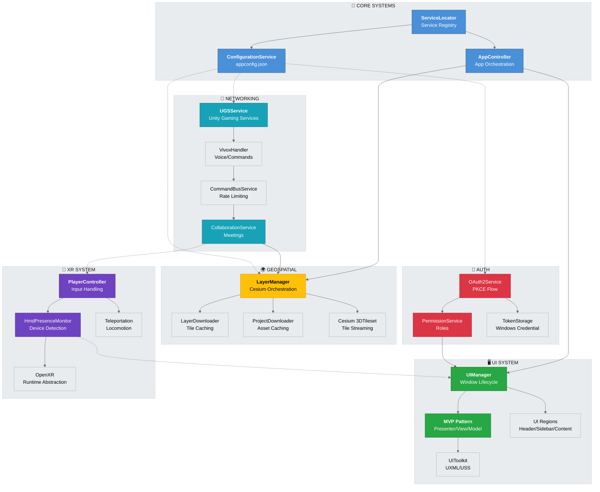

---

## Legende

| Farbe | Subsystem | Hauptdateien |
|-------|-----------|--------------|
| 🔵 Blau | **Core Systems** | ServiceLocator.cs, AppController.cs, ConfigurationService.cs |
| 🟢 Grün | **UI System** | UIManager.cs, PresenterBase.cs, ViewBase.cs |
| 🟡 Gelb | **Geospatial** | LayerManager.cs, LayerDownloader.cs, Cesium Prefabs |
| 🟣 Lila | **XR System** | PlayerController.cs, HmdPresenceMonitorService.cs |
| 🔵 Cyan | **Networking** | UGSService.cs, VivoxHandler.cs, CollaborationService.cs |
| 🔴 Rot | **Auth** | OAuth2AuthenticationService.cs, PermissionService.cs |

---


## Big Topics

Diese Themen erfordern tieferes Verständnis:

1. **ServiceLocator** - Zentrale Service-Registry, DontDestroyOnLoad
2. **AppController** - Scene Loading, UI Setup, App Lifecycle
3. **ConfigurationService** - appconfig.json, User Settings
4. **UIManager** - Window Lifecycle, Regions, MVP Orchestration
5. **MVP Pattern** - Presenter/View/Model Architektur
6. **LayerManager** - Cesium Layers, Projects, Variants
7. **PlayerController** - Input Handling, XR/Desktop Switch
8. **HmdPresenceMonitor** - VR Device Detection
9. **UGSService** - Unity Gaming Services Facade
10. **CollaborationService** - Meetings, Voice, Commands

---

## Small Topics 

Diese Themen sind Detail-Aspekte:

- **UIToolkit** - UXML, USS, UIDocument
- **UI Regions** - Header, Sidebar, Content1, Overlay, Toast
- **LayerDownloader** - 3D Tiles Caching
- **ProjectDownloader** - glTF/GLB Asset Caching
- **Cesium 3DTileset** - Native Tile Streaming
- **Teleportation** - XR + Keyboard Teleport
- **OpenXR** - Runtime Abstraction Layer
- **VivoxHandler** - Voice Channels, Commands
- **CommandBusService** - Rate Limiting, Event Dispatch
- **TokenStorage** - Windows Credential Manager
- **PermissionService** - Owner/Moderator/User Roles


---


# Architecture Diagrams

## 1. Bootstrap / Runtime Flow

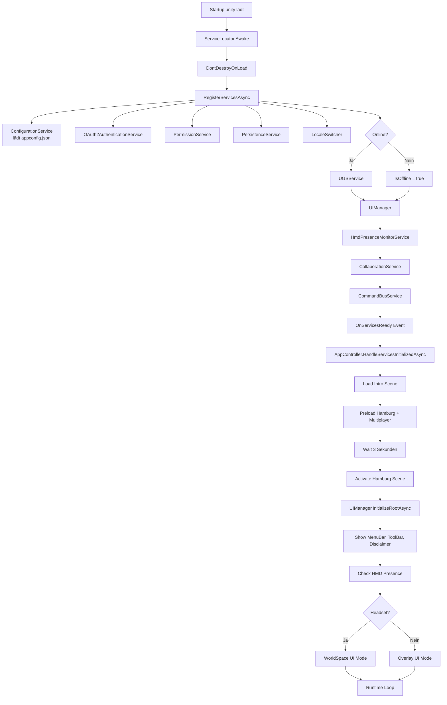

---


## 2. UI Architecture (UIToolkit + MVP + UIManager)

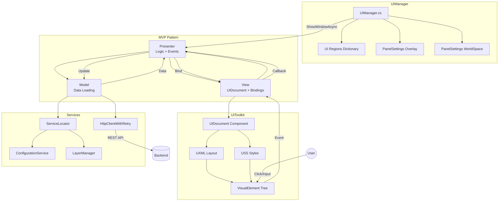


### UI Regions

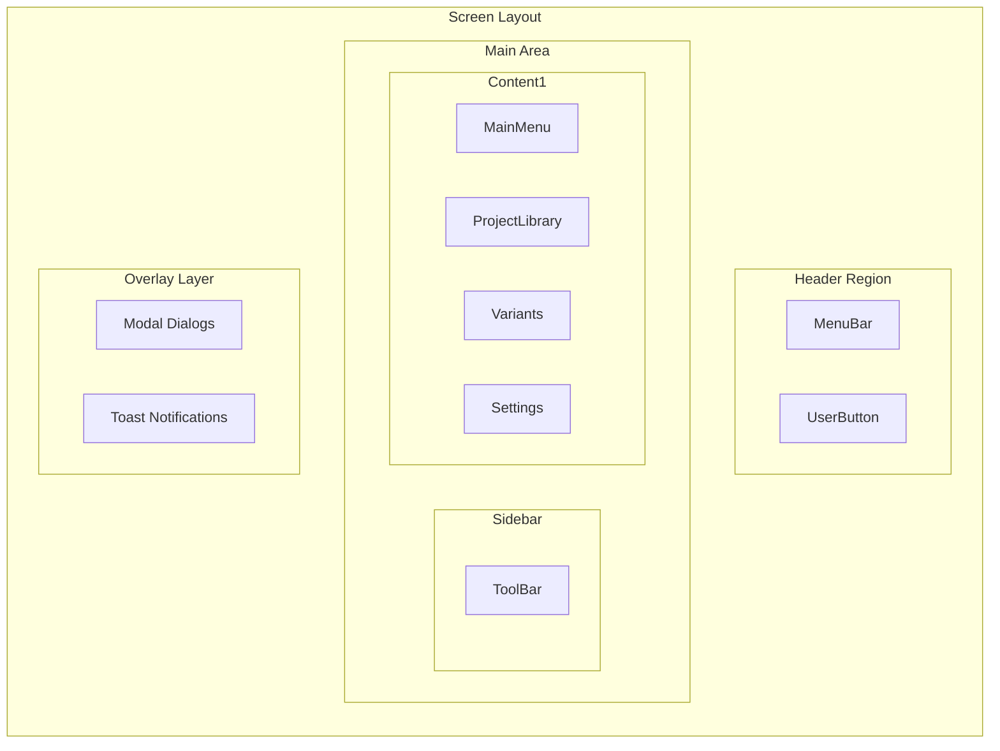

---


## 3. Backend/Config Flow

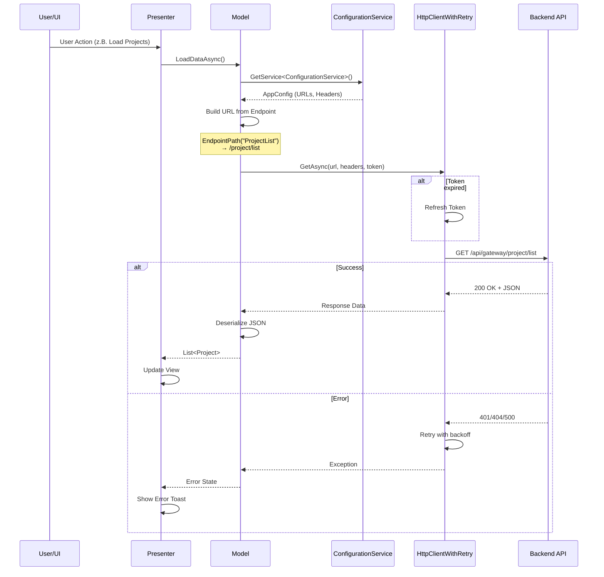

---


## 4. OAuth2 PKCE + Custom Browser Flow

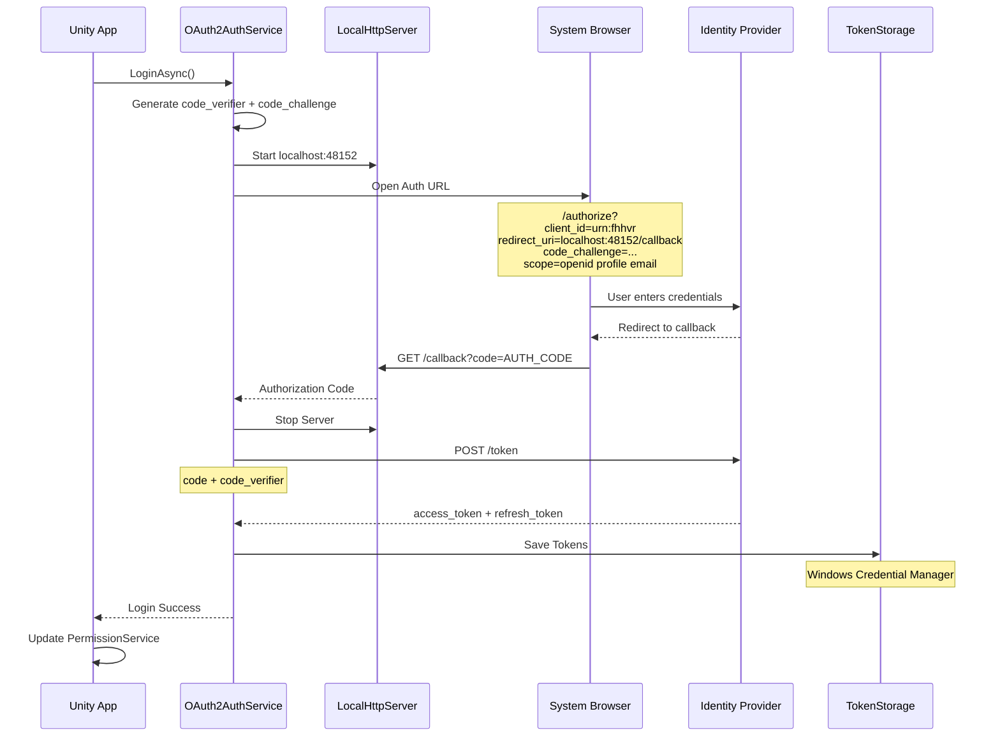

---


## 5. Cesium Tile Loading Flow

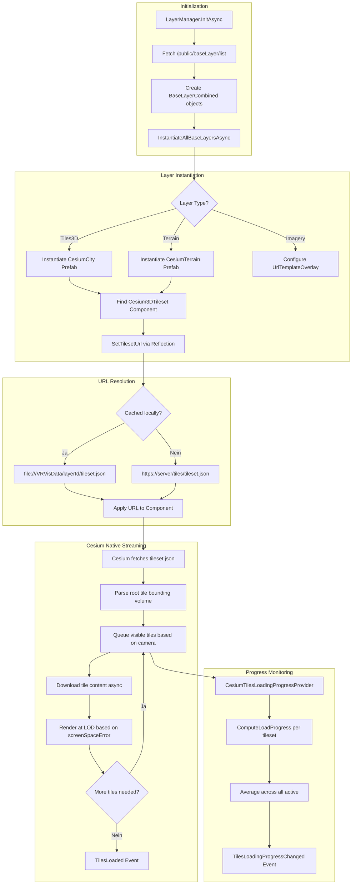

---


## 6. XR Input Mode Switching

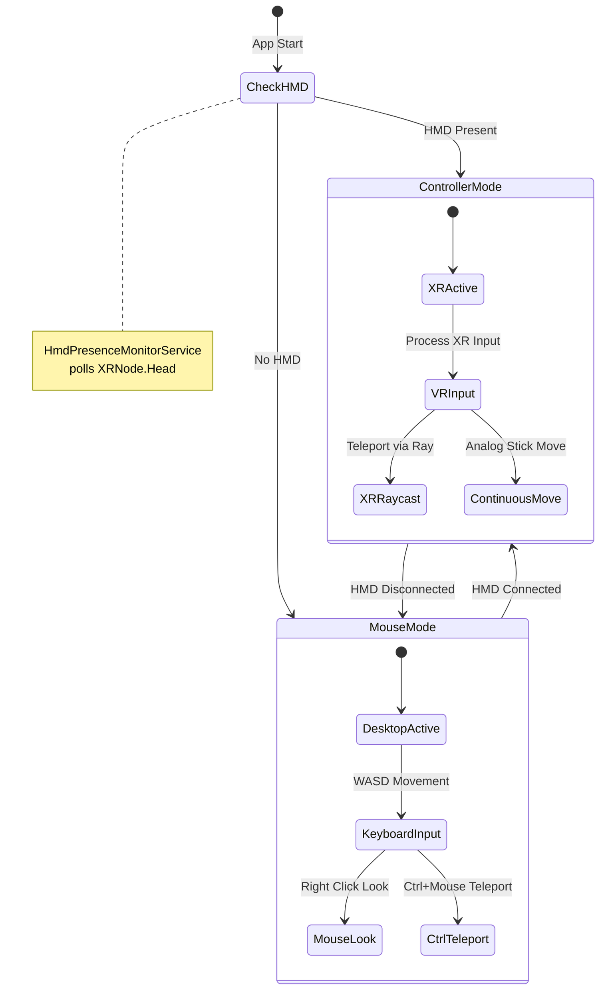

---


## 7. Collaboration / Command Flow

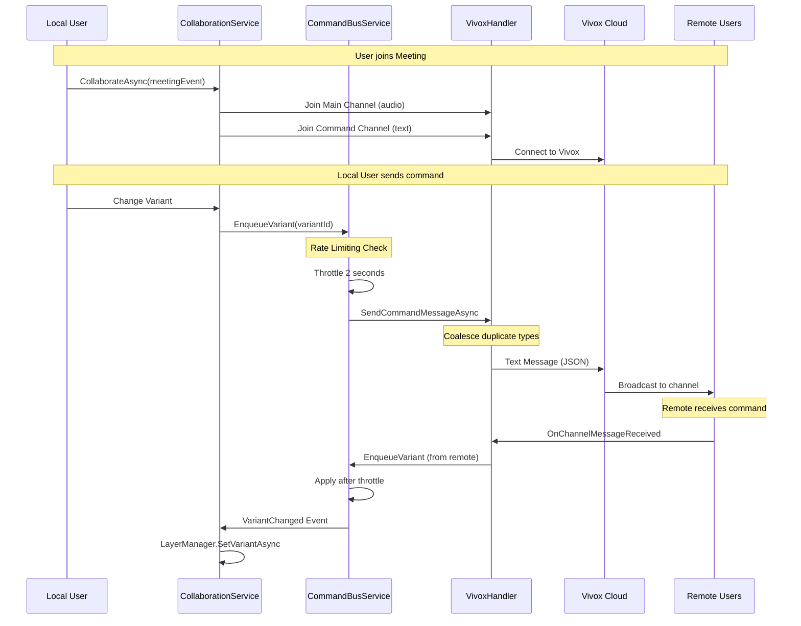

---


## 8. Service Lifecycle

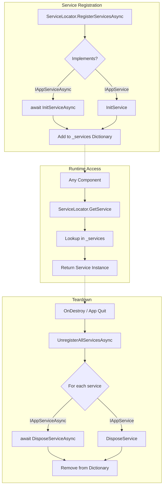


---
---


# Project Inventory / New-Dev Orientation

## Repo Map: "Where to Find X"

| Was suche ich? | Wo finde ich es? |
|----------------|------------------|
| **Startup-Szene** | `Assets/FHH/Scenes/Startup.unity` |
| **ServiceLocator** | `Assets/FHH/Logic/ServiceLocator.cs` |
| **AppController** | `Assets/FHH/Logic/AppController.cs` |
| **UIManager** | `Assets/FHH/UI/UIManager.cs` |
| **Server-Konfiguration** | `Assets/StreamingAssets/appconfig.json` |
| **AppConfig-Klasse** | `Assets/Foxbyte/Core/Services/ConfigurationService/AppConfig.cs` |
| **LayerManager** | `Assets/FHH/Logic/LayerManager.cs` |
| **PlayerController/Input** | `Assets/FHH/Input/PlayerController.cs` |
| **Input Actions** | `Assets/FHH/Input/XRI VRVis Input Actions.inputactions` |
| **MVP UI-Framework** | `Assets/Foxbyte/Presentation/` |
| **UI Feature Slices** | `Assets/FHH/UI/<FeatureName>/` |
| **OpenXR Settings** | `Assets/XR/Settings/OpenXR Package Settings.asset` |
| **Cesium Prefabs** | `Assets/FHH/Prefabs/` (CesiumCity, CesiumTerrain, CesiumTrees) |
| **Build Profile** | `Assets/Settings/Build Profiles/Windows Release.asset` |
| **Localization Tables** | `Assets/FHH/Localization/Tables/` |
| **User Settings Model** | `Assets/FHH/Logic/Models/UserSettings.cs` |
| **Networking/Collaboration** | `Assets/FHH/Logic/Components/Networking/` |
| **VR Locomotion** | `Assets/FHH/Logic/VR/` |


---


## Key Folders and Their Contents

### `Assets/FHH/` — Domain-Specific Code
```
Assets/FHH/
├── Scenes/              → Startup, Intro, Hamburg, UI, Multiplayer
├── Logic/               → ServiceLocator, AppController, LayerManager
│   ├── Components/      → Cesium, Networking, Collaboration, HmdPresence
│   ├── Models/          → Project, User, UserSettings, DTOs
│   └── VR/              → Teleportation, Origin alignment
├── UI/                  → MVP Feature Slices (MenuBar, ToolBar, etc.)
├── Input/               → PlayerController, Input Actions
├── Prefabs/             → ServiceLocator, XR Rig, UI, Cesium templates
├── Localization/        → String tables (de, en)
└── AppResources/        → Materials, Fonts, Textures
```

### `Assets/Foxbyte/` — Reusable Framework
```
Assets/Foxbyte/
├── Core/
│   ├── ServiceLocator/  → ServiceLocatorBase, IAppService interfaces
│   ├── Services/
│   │   ├── ConfigurationService/  → AppConfig loading, user prefs
│   │   ├── OAuth/                 → OAuth2 flow, token storage
│   │   ├── Permission/            → Role-based access (Owner/Mod/User)
│   │   └── Persistence/           → JSON persistence, PlayerPrefs
│   └── Http/            → HttpClientWithRetry (circuit breaker, backoff)
└── Presentation/
    ├── PresenterBase.cs → MVP Presenter base class
    ├── ViewBase.cs      → MVP View base class
    ├── UIProjectContext.cs → UI Regions (Header, Sidebar, Content, etc.)
    └── WindowOptions.cs → Window display configuration
```

### `Assets/StreamingAssets/`
```
appconfig.json          → Server URLs, OAuth, TilesBaseUrl, endpoints
```

### `Assets/XR/Settings/`
```
OpenXR Package Settings.asset → Controller profiles, render mode
```

---

## Entry Points (Scenes, Bootstraps)

### Boot Sequence
```
1. Startup.unity lädt
   └─> ServiceLocator.Awake() → DontDestroyOnLoad
       └─> RegisterServicesAsync()
           ├─> ConfigurationService (lädt appconfig.json)
           ├─> OAuth2AuthenticationService
           ├─> PermissionService
           ├─> PersistenceService
           ├─> LocaleSwitcher
           ├─> UGSService (optional, wenn online)
           ├─> UIManager
           ├─> HmdPresenceMonitorService (optional)
           ├─> CollaborationService
           └─> CommandBusService

2. AppController.OnServicesReady()
   └─> Lädt Intro-Szene (3s anzeigen)
   └─> Preload Hamburg + Multiplayer Szenen
   └─> Aktiviert Hamburg-Szene
   └─> Initialisiert UIManager mit Regionen
   └─> Zeigt MenuBar, ToolBar, Disclaimer

3. Runtime Loop
   └─> Input verarbeiten (VR oder Desktop)
   └─> Cesium Tiles streamen
   └─> UI Events verarbeiten
```

### Scene Overview
| Szene | Zweck |
|-------|-------|
| `Startup.unity` | Bootstrap, ServiceLocator |
| `Intro.unity` | Splash Screen (3 Sekunden) |
| `Hamburg.unity` | Hauptszene mit Cesium-Daten |
| `UI.unity` | UI Root Layer |
| `Multiplayer.unity` | Collaboration/Networking |

---

## Important Concepts

### 1. ServiceLocator Pattern
- Zentrale Service-Registry für alle Dienste
- Zugriff: `ServiceLocator.GetService<T>()`
- Services implementieren `IAppService` oder `IAppServiceAsync`

### 2. MVP UI Architecture
- **Model**: Daten laden via Services
- **View**: UIDocument + UXML/USS bindings
- **Presenter**: Logik, Event-Subscriptions
- Location: `Assets/FHH/UI/<Feature>/`

### 3. appconfig.json
- Externalisierte Konfiguration
- Server-URLs, OAuth, TilesBaseUrl
- Keine Code-Änderungen für City-Wechsel

### 4. LayerManager
- Orchestriert Cesium 3D Tiles
- Verwaltet Projekte und Varianten
- Events: `OnProjectChanged`, `OnVariantChanged`

### 5. UniTask Async Pattern
- Ersetzt `Task/await` für bessere Performance
- `await UniTask.Delay()`, `.Forget()` für fire-and-forget
- CancellationToken Support überall

### 6. XR Fallback System
- `HmdPresenceMonitorService` erkennt Headset
- `PlayerController` wechselt zwischen Controller/Mouse
- Automatic: VR-Headset anschließen → VR-Modus

### 7. UIManager Window Lifecycle
- `ShowWindowAsync<P,V,M>()` zeigt Presenter
- `HideAsync<P>()` schließt Fenster
- Regions: Header, Sidebar, Content1, Overlay, Toast

### 8. OAuth2 + Custom Browser Flow
- Loopback redirect: `localhost:48152/callback`
- Token in Windows Credential Manager
- Automatic refresh

### 9. Vivox Voice + Command Bus
- Text-Channel für Commands (Variant, Teleport, Sun)
- Audio-Channel für Voice
- Rate limiting (2s throttle)

### 10. Offline Mode
- `ServiceLocator.IsOffline` Flag
- Cached Layers funktionieren offline
- UGS/Collaboration deaktiviert

---

## Quick Reference: Adding Features

### Neues UI-Fenster
```
1. Ordner erstellen: Assets/FHH/UI/<FeatureName>/
2. Dateien:
   - <Feature>Presenter.cs : PresenterBase<P,V,M>
   - <Feature>View.cs : ViewBase<P>
   - <Feature>Model.cs : PresenterModelBase
3. Anzeigen via: UIManager.ShowWindowAsync<P,V,M>()
```

### Neuer Backend-Endpoint
```
1. appconfig.json: Endpoint hinzufügen
2. ConfigurationService: URL abrufen
3. HttpClientWithRetry: Request senden
```

### Neue Config-Eigenschaft
```
1. appconfig.json: Wert hinzufügen
2. AppConfig.cs: Property hinzufügen
3. Zugriff: ServiceLocator.GetService<ConfigurationService>().AppConfig
```

