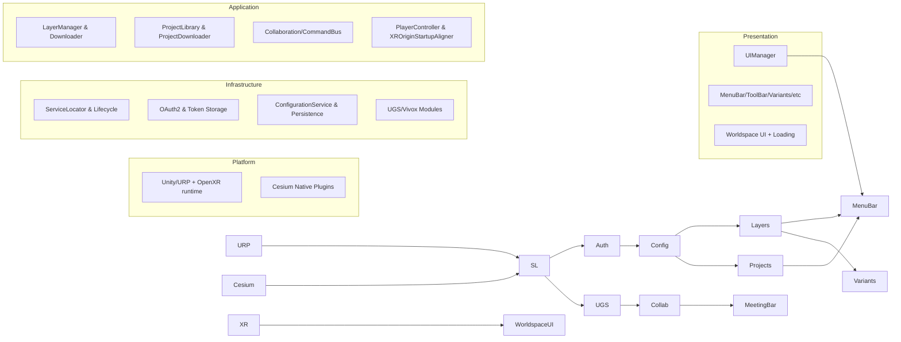
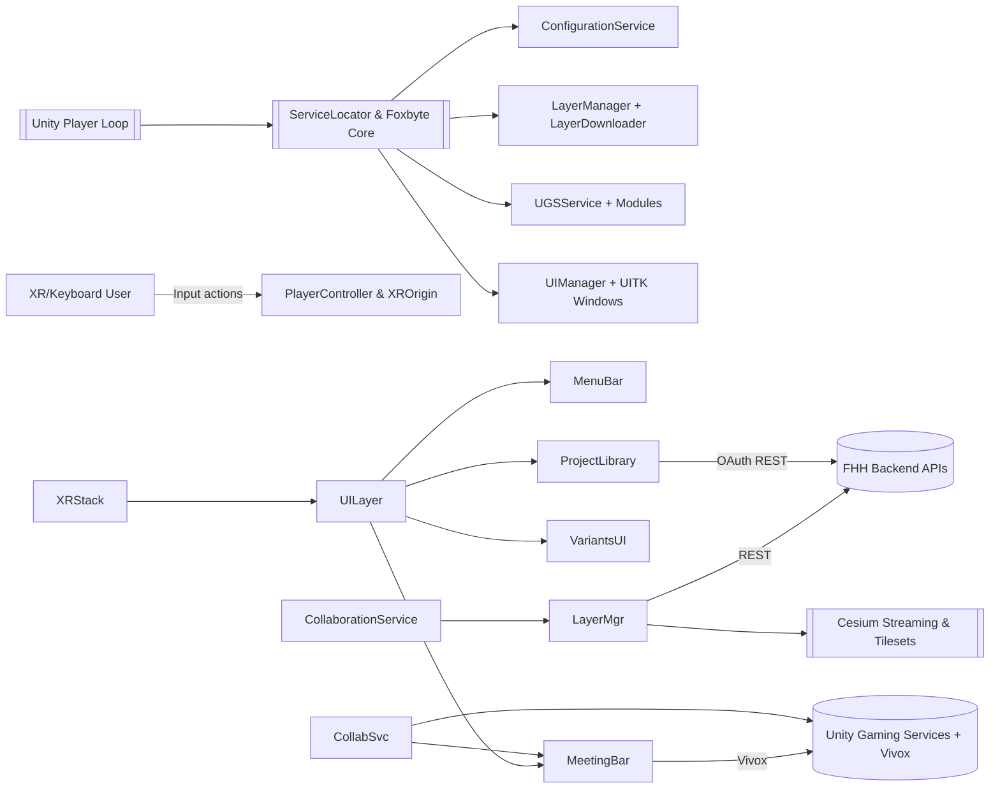
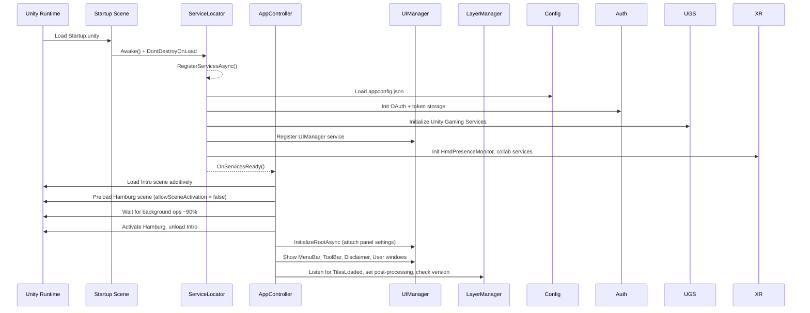
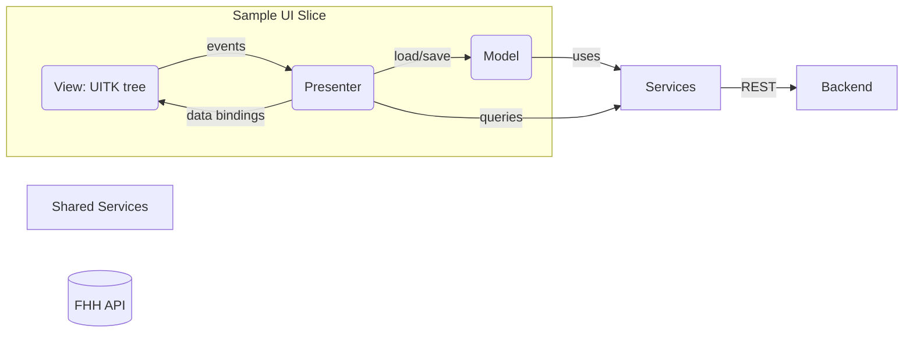

# VRVis XR Twin

VRVis is a Unity 6000.2.7f2 project that streams high-fidelity Cesium geospatial layers of Hamburg into a collaborative XR environment. It combines PC VR locomotion, Cesium tiles, and Unity Gaming Services (Vivox/Relay) to stage guided briefings, joint variant reviews, and kiosk-style walkthroughs when no headset is present.

The repository contains both the domain-specific logic (`Assets/FHH`) and the reusable Foxbyte framework (service locator, UI MVP stack, OAuth, persistence). Everything boots from the `Startup` scene where services register, check backend reachability, and pre-load the Hamburg scene along with the UI root.

## Requirements

- **Unity**: 6000.2.7f2 with the included URP, Input System, Localization, and OpenXR packages.

- **Operating system**: Windows 10/11 for development and builds.

- **XR runtimes**: OpenXR runtime for the target HMD (SteamVR, Windows Mixed Reality, Meta Quest Link, etc.). Mock HMD settings are included for desktop testing.

- **External services**: Access to a configured backend with provided tilesets and User authentication.

## Run in the Editor

1. Install Unity 6000.2.7f2 via Unity Hub and open the repository folder as a project.

2. In *Project Settings → XR Plug-in Management → OpenXR*, select the runtime that matches your headset.

3. Open `Assets/FHH/Scenes/Startup.unity`; the editor utility `EditorStartSceneOverride` keeps it as the play-mode entry point.

4. Press *Play*. `ServiceLocator` initializes `ConfigurationService`, loads `StreamingAssets/appconfig.json`, signs in (or starts offline), sets up `UIManager`, and preloads `Assets/FHH/Scenes/Hamburg.unity` in the background.

5. Use `PlayerController` keyboard bindings (XRI `XRI VRVis Input Actions`) when no headset is present, or an OpenXR-compatible HMD + controllers when available.

## Build for Windows

1. Open *Window → Asset Management → Build Profiles* and load `Assets/Settings/Build Profiles/Windows Release.asset` (or use *File → Build Settings* with the same scene list: Startup, Intro, UI, Hamburg, Multiplayer).

2. Verify *Player Settings → XR Plug-in Management → OpenXR* has the required controller profiles (Oculus Touch, Vive, WMR, Meta Touch Pro, Valve Index, etc.) enabled. 

3. Choose *PC, Mac & Linux Standalone → Windows* and build. The output expects the `StreamingAssets/appconfig.json` file to ship alongside the executable.

4. On the target PC, set the preferred OpenXR runtime (Windows Mixed Reality, SteamVR, Oculus) before launching the build.

## Supported platforms & devices

- Windows desktop with keyboard/mouse fallback.

- PC VR headsets exposed through OpenXR: Meta Quest (via Link/Air Link), HTC Vive / Vive Pro, Valve Index, HP Reverb / WMR devices, and any controller covered by the OpenXR profiles checked into `Assets/XR/Settings/OpenXR Package Settings.asset`.

## Project structure

- `Assets/FHH` – application code: scenes, geospatial logic (`LayerManager`, `ProjectDownloader`), VR locomotion, UI feature slices (MenuBar, ProjectLibrary, Variants, MeetingBar, etc.).

- `Assets/Foxbyte` – reusable infrastructure: service locator base, MVP UI framework, OAuth2 client, persistence, localization helpers, rendering utilities.

- `Assets/StreamingAssets/appconfig.json` – live configuration for server endpoints, tiles, OAuth settings, and logging.

- `Assets/XR/Settings` – OpenXR runtime configuration, controller profiles, and panel input settings for worldspace UI.

- `Assets/CesiumSettings` – Cesium runtime preferences and (optional) Cesium Ion server definitions.

- `Settings/Build Profiles` – build configurations (Windows Release, Performance/Beauty URP profiles).

## Configuration & city switching

`ConfigurationService` (Foxbyte.Core.Services.ConfigurationService) reads `StreamingAssets/appconfig.json` at startup and exposes `AppConfig` through the service locator. The file defines:

- OAuth endpoints, client ID, and redirect URIs.

- REST endpoints for base layers, projects, events, and download links.

- `TilesBaseUrl`, which LayerDownloader uses when fetching Cesium tiles for the active city.

- HTTP headers that must be attached to API calls.

City-specific content (layers, starting points, project variants) is not hard-coded; it is downloaded via the endpoints described above. To switch environments you can:

1. Change the URLs or scopes inside `appconfig.json` and restart the app; `ServiceLocator` will reload the file on boot.

2. Override tiles or projects per build by editing the same file before distribution.

3. For user-level preferences (language, performance mode, movement speeds), use `ConfigurationService.SaveUserSetting…` APIs; they persist to `PlayerPrefs` with the `FB\_` prefix.

## 1. Project overview

City data streaming is orchestrated by Cesium 3D Tilesets (base layers and project-specific variants) while the XR locomotion stack  exposes both controller and keyboard navigation so the same build can double as a VR and desktop viewer. Collaborative voice and command traffic are delegated to Unity Gaming Services (UGS) modules via `Assets/FHH/Logic/Components/Networking`, allowing moderators to host meetings or replay variants with synchronized sun position and teleport commands. The application’s constraints revolve around sustained high FPS rendering on Windows PCs, predictable OpenXR behavior across SteamVR/WMR/Meta runtimes, and stable streaming of multi-gigabyte Cesium tiles over constrained networks.

The repository is organized so that Foxbyte’s reusable infrastructure (service locator, MVP UI framework, OAuth client, persistence, localization) lives under `Assets/Foxbyte`, whereas domain-specific logic, scenes, and UITK prefabs sit beneath `Assets/FHH`. Because configuration data is deliberately externalized into `Assets/StreamingAssets/appconfig.json`, no build contains hard-coded city coordinates or endpoints—the app can boot offline, detect reachability, and only then decide whether to pull Hamburg-specific layers or serve cached content.

## 2. Bird’s-eye architecture and rationale

At runtime the application behaves like a layered service host. `ServiceLocator` (a prefab in `Assets/FHH/Prefabs/ServiceLocator.prefab`) is placed in the `Startup` scene and inherits from `Foxbyte.Core.ServiceLocator.ServiceLocatorBase`. During `Awake` it calls `DontDestroyOnLoad`, ensuring all services survive the additive scene choreography. `ServiceLocator.RegisterServicesAsync` registers `ConfigurationService`, OAuth, permissions, persistence, localization, Unity Gaming Services, UIManager, XR subsystems, and Collaboration modules in a deterministic order. Each registration type-checks for `IAppService`/`IAppServiceAsync`, so init/dispose routines run automatically on scene transitions or shutdown.

`AppController` (`Assets/FHH/Logic/AppController.cs`) subscribes to `ServiceLocator.OnServicesReady`, preloads the Intro and Hamburg scenes additively, and only then activates UI menus, project toolbars, disclaimers, and voice-overlays. Hamburg acts as the “world” scene containing the XR rig, Cesium templates, and UI prefabs, while optional scenes load later when collaboration features are requested. Because each feature slice acquires services through the locator, extending the project typically means adding a module and registering it once, rather than touching every scene.

The same locator also owns teardown: `ServiceLocatorBase.OnDestroy` iterates over registered services and invokes either `DisposeService` or `DisposeServiceAsync`, preventing lingering Vivox connections, XR subsystems, or HTTP clients when the player quits or reloads. The pattern is intentionally leaner than dependency injection containers: there is no reflection-based composition, only typed registration and retrieval via `ServiceLocator.GetService<T>()`. That choice reduces GC pressure and iteration time for XR projects running at high frame rates.

## 3. Layered architecture and dependency flow

The codebase follows a pragmatic layering model: Unity runtime + platform glue at the bottom, infrastructure services on top of it, application logic encapsulating workflows, and presentation/UI slices consuming the logic. Dependencies only flow downward; UI presenters talk to `LayerManager`, `CollaborationService`, and configuration services, never vice versa. The diagram below summarizes the layers.

Presentation components (UITK windows) never reach into Unity Gaming Services directly—they call services such as `CollaborationService` or `LayerManager`. Application services in turn can depend on infrastructure (config, persistence, OAuth) but are agnostic of UI, which makes it possible to run background flows (cache downloads, layer refresh) while no UI is mounted.

## 4. Components and subsystem map

The following C4-style view shows how the major subsystems collaborate.

`LayerManager` organizes backend data and in-scene Cesium instances: it queries `BaseLayers` endpoints, instantiates prefabs (`CesiumCity`, `CesiumTerrain`, `CesiumTrees`), enables origin-shifting via `CesiumGlobeAnchor` and `CesiumOriginShift`, and coordinates SceneView changes when a new project variant is chosen. `ProjectLibraryPresenter` exposes project download and activation flows; it talks to `ProjectDownloader` for offline caching and to `LayerManager.Instance` for activation. `CollaborationService` consumes UGS voice modules plus the custom `CommandBusService` so moderators can broadcast variant/sun/time changes.

## 5. Entry points and boot flow

Startup is additive and asynchronous. The sequence below mirrors what happens when pressing Play or launching a build.

`AppController` also monitors permission changes (`PermissionService.UserChanged`) so that when a user becomes anonymous the app unloads sensitive layers via `LayerManager.UnloadProjectAsync` and hides UI requiring authentication.

## 6. Service locator specifics and lifecycle

`Foxbyte.Core.ServiceLocator.ServiceLocatorBase` manages a dictionary of services keyed by type. `ServiceLocator.RegisterServicesAsync` awaits `LocalizationSettings.InitializationOperation`, performs a short connectivity probe (`CheckBackendReachableAsync` hitting `/public/baseLayer/list`), and toggles an `IsOffline` flag to short-circuit UGS or backend logic in offline mode. When offline, collaboration services and voice modules are not instantiated, but UI still loads so the user can inspect cached layers.

Each service implements either `IAppService` or `IAppServiceAsync`. Examples include:

- `ConfigurationService` (async) loads `StreamingAssets/appconfig.json`, handles player preference read/write, and exposes `AppConfig` and user settings objects.

- `OAuth2AuthenticationService` (sync) stores tokens in `WindowsTokenStorageProvider`, invoking the loopback browser handler when refresh tokens expire.

- `UGSService` (async) is a façade that waits for `UnityServices.InitializeAsync`, authenticates anonymously, and later accepts `VivoxHandler`, and `VivoxCommandHandler` modules via `RegisterModuleAsync`.

- `CollaborationService` (sync) glues permission service, `LayerManager`, `PlayerController`, `LaserPointSelector`, `SunCalculator`, and Vivox command channels. It keeps an internal CTS to cancel sessions gracefully.

Teardown is explicit. `ServiceLocatorBase.UnregisterAllServicesAsync` iterates over every service, awaiting `DisposeServiceAsync` implementations (e.g., `CollaborationService.StopSession`, `UGSService.DisposeServiceAsync`). On destruction, `ServiceLocatorBase.OnDestroy` catches any disposal exception and logs via `ULog.Error`, ensuring Unity remains responsive even if a service fails to shut down.

## 7. UI architecture: MVP slices and navigation

Foxbyte’s MVP stack (`Assets/Foxbyte/Presentation`) is central to UI composition. Each feature defines:

- A `Presenter` derived from `PresenterBase<TPresenter,TView,TModel>`.

- A `View` inheriting from `ViewBase<TPresenter>` that owns a UITK `UIDocument`, style sheet references, and localized bindings.

- A `Model` derived from `PresenterModelBase` to fetch data asynchronously with cancellation tokens.

- An optional `ViewGenerator` that instantiates UITK trees programmatically, while UI built with UIBuilder can be instantiated and fed to the View as well

`UIManager` (`Assets/FHH/UI/UIManager.cs`) orchestrates these slices. It keeps dictionaries of presenters per region defined in `UIProjectContext` (header, sidebar, content zones, toast overlays) and can switch between overlay and worldspace panel settings at runtime. UI windows request dependencies through the service locator; for example, `ProjectLibraryPresenter` loads projects from `ProjectLibraryModel`, then calls `LayerManager.Instance.SetProjectAsync`. `VariantsPresenter` shows radio buttons bound to `LayerManager.Instance.OnProjectChanged`. `MeetingBarPresenter` wires up Vivox mute toggles, guided mode controls, and time synchronization through `CommandBusService`.

Navigation uses `WindowOptions`. Presenters can target a region (`UIRegion.Header`, `Sidebar`, `Content1`), supply a style sheet, and optionally mark themselves modal so `UIManager` inserts a glass pane. By default UI windows fade in/out (`VisualElementExtensions.FadeToAsync`) and register for localization updates through `ViewBase.BindLocalization`.

Adding a new UI slice follows this pattern: create view/presenter/model under `Assets/FHH/UI/NewFeature`, register it with `UIManager.ShowWindowAsync` (often in `AppController.SetupUiAsync` or from another presenter), and pull dependencies through `ServiceLocator`.

## 8. Unity worldspace UI evolution

Early iterations relied on custom worldspace canvases, and remnants of that approach remain in `Assets/FHH/Logic/VR/WorldSpaceUiFollower.cs` and `Assets/FHH/UI/LoadingScreen/LoadingScreen.cs`. The follower component still repositions a UITK panel relative to the XR camera when Cesium tiles finish loading, ensuring the HUD snaps to the headset’s forward vector (`InputAction "Snap UI"`). However, Unity 6’s worldspace UITK support allowed the team to standardize on `PanelSettings` assets (`\_psOverlay`, `\_psWorldSpace`) and `PanelInputConfiguration` objects serialized inside `Startup.unity` (with `m\_ProcessWorldSpaceInput = 1`).

`UIManager.InitializeRootAsync` now receives both overlay and worldspace panel settings and can switch between them by calling `SetUIMode`. `AppController` checks `HmdPresenceMonitorService.CheckIfXRDeviceIsPresent()`; if a headset exists the UI mounts worldspace panels, otherwise it falls back to a desktop overlay. Loading sequences (`WorldSpaceLoading` UIDocument inside Hamburg scene) fade in/out by driving UITK styles rather than swapping canvases. Legacy components such as `WorldSpaceUiFollower` are retained to handle cases where Unity’s built-in tracking fails or where the UI needs to be aligned with the XR rig when Cesium origin shifts.

## 9. OpenXR challenges and device handling

The project supports a wide array of OpenXR profiles (`Assets/XR/Settings/OpenXR Package Settings.asset` lists HTC Vive, WMR, Oculus Touch, Meta Touch Pro, Valve Index, HP Motion Controllers, KHRSimple, Palm Pose, Hand Tracking). Managing these devices requires several mitigations:

- `HmdPresenceMonitorService` (Foxbyte `IAppService`) probes `XRNode.Head` devices, tracks FoV, toggles `IsDeviceEnabled`, and exposes an event to adapt UI modes. It notes that OpenXR currently has a bug where disconnects may not fire, so the service also polls when subsystems are checked by `XrOriginStartupAligner`.

- `XrOriginStartupAligner` waits for the OpenXR input subsystem, forces device origin mode before switching to floor space, aligns yaw to the app’s desired forward, and triggers `OpenXRSettings.SetAllowRecentering` for runtimes that support it. It realigns after head tracking becomes valid, solving the “rotated room” issue on SteamVR or WMR.

- `PlayerController` binds keyboard, mouse, and XR inputs through the Input System asset `XRI VRVis Input Actions`. Teleportation, snap turns, vignette toggles, and move/fly speeds are exposed as events so UI (MenuBar, ToolBar) can reflect changes. The controller also integrates with Cesium georeferencing by storing fallback ECEF positions and aligning the XR origin with city coordinates once `CesiumTilesLoadingProgressProvider` fires.

- Because not all runtimes expose the same controller features, `OpenXR Package Settings.asset` selectively enables vendor-specific interaction profiles while leaving advanced extensions (hand tracking, palm pose) disabled by default. Developers can toggle them when testing new hardware.

These mitigations matter because OpenXR runtimes differ in controller naming, recentering behavior, and `XRInputSubsystem` readiness. The combination of input-system bindings, runtime toggles, and UI fallbacks ensures the viewer still runs on laptop-only setups.

## 10. Cesium for Unity integration

Cesium integration spans prefab templates, runtime utilities, and layer orchestration:

- The Hamburg scene contains placeholders for `CesiumCity`, `CesiumTerrain`, and `CesiumTrees` prefabs. `LayerManager` instantiates or reuses these based on server responses. Components such as `CesiumDistanceMipBiasController` and `CesiumColliderGenerator` adjust LOD bias or colliders dynamically.

- `CesiumPlacement` converts server-provided ECEF coordinates/rotations into the `CesiumGlobeAnchor` system and adds `CesiumOriginShift` for floating-origin stability.

- `CesiumTilesLoadingProgressProvider` monitors all active `Cesium3DTileset` components, averages their `ComputeLoadProgress()` values, and broadcasts `TilesLoaded` events. `PlayerController` and `AppController` both subscribe to adjust vignette / post-processing and to snap the worldspace UI to the camera.

- `LayerDownloader` downloads base layers or imagery into `%LOCALAPPDATA%/VRVisData`, writes manifest metadata, and verifies disk space before fetching tens of thousands of tiles. It also replaces Cesium imagery templating tokens (`{z}/{x}/{y}` → `{z}/{x}/{ReverseY}`) depending on backend formats.

- For project-specific assets (e.g., building massing models), `ProjectDownloader` fetches GLB/GLTF files, appends SAS tokens when needed, and rewrites URLs so Cesium tilesets can load them from disk even offline.

Because Cesium adds heavy native dependencies (`com.cesium.unity`), the project isolates geospatial orchestration inside `LayerManager` and uses services to guard operations. For example, `ServiceLocator.IsOffline` prevents restricted layer downloads and UGS registrations when connectivity is absent, avoiding Cesium’s native HTTP threads from spamming unreachable URLs.

## 11. Instability notes (Cesium & OpenXR)

Combining Cesium’s native library with other XR stacks occasionally triggers `GCHandle` exceptions or native pointer issues. Reports document `ArgumentException: GCHandle value belongs to a different domain` thrown from `Reinterop.ObjectHandleUtility` inside `com.cesium.unity`. Both native libraries can interact with the Unity Editor in unexpected ways resulting in Editor crashes. Future Cesium/OpenXR updates should improve this situation.

## 12. City configuration and new-city adaptation

City-specific data is delivered through backend endpoints declared in `StreamingAssets/appconfig.json`:

- `ServerConfig.Endpoints` lists named paths (`BaseLayers`, `ProjectList`, `Project`, `Events`, etc.).

- `TilesBaseUrl` points to the root of Cesium 3D Tiles for Hamburg.

- Optional headers, scopes, and SSE endpoints live alongside.

`ConfigurationService` exposes the parsed `AppConfig`, while `LayerManager` and `ProjectLibraryModel` translate endpoint names into URLs via `EndpointPath`/`Url`. Adding a new city entails both configuration and backend tasks:

1. **Provision backend data**: Ensure the API provides base layer metadata, project lists, starting points, variants, GLB assets, and events for the new city. Each layer should have IDs, URLs, and type metadata.

2. **Duplicate appconfig**: Create an environment-specific `appconfig.json` (or script to swap them during CI) with the new `ApiBaseUrl`, `TilesBaseUrl`, OAuth endpoints, and named routes.

3. **Update Cesium assets**: If the new city uses different templates (terrain offsets, tree prefabs), author matching prefabs under `Assets/FHH/Logic/Cesium` and configure `LayerManager` to point at them.

4. **Extend Menu/UI**: Add locale entries so UI buttons and disclaimers mention the correct city. No code changes are needed because presenters read project names from backend payloads.

5. **Test matrix**: Validate offline boot (no network), online boot, variant switching, restricted layers, project downloads, and collaboration flows. Use the `ProjectDownloader` download/remove logic to ensure caches clear between cities.

6. **Deployment**: Ship the correct `appconfig.json` with the build. If multiple cities must co-exist, add a selector by exposing multiple configs (`ConfigurationService` already supports reading user settings; a small menu could toggle stored `ApiBaseUrl`).

Remember to update `TilesBaseUrl` and `Tileset` entries to match Cesium Ion or Azure Blob endpoints. If the new city relies on private Cesium Ion access tokens, populate `Assets/CesiumSettings/Resources/CesiumRuntimeSettings.asset` accordingly.

## 13. Backend and collaboration integration

Authentication relies on OAuth 2.0. `OAuth2AuthenticationService` combines a `WindowsTokenStorageProvider`, `HttpClientWithRetry`, and `BrowserHandler` to support loopback redirect URIs on Windows. Scopes (`openid profile email`) and endpoints are defined in `appconfig`. After login, `PermissionService` stores roles (anonymous/moderator/owner) so UI components can gate functionality via `RequiredPermissions`.

`ProjectLibraryModel` and `LayerManager` both use `HttpClientWithRetry` to talk to backend endpoints. `LayerManager` also interprets HTTP headers specified in config (e.g., `Accept: application/json`). `ProjectDownloader` adds SAS query parameters from `Project.ProjectSasQueryParameters` to every GLB fetch.

Collaboration is orchestrated through Unity Gaming Services:

- `UGSService` initializes Unity Services, authenticates anonymously, and keeps a registry of modules (`RelayHandler`, `SessionManagers`, `VivoxHandler`, `VivoxCommandHandler`).

- `CollaborationService` retrieves HTTP endpoints (events host/rehost/heartbeat) from `AppConfig`, manages meeting moderation, and forwards command updates (variant changes, teleport coordinates, guided mode toggles) through Vivox using JSON payloads (`CommandPayload`).

- `CommandBusService` throttles events (mute all, indicator positions, sun/time) so remote clients aren’t flooded. It stores the last applied payload and only forwards new ones after a cooldown.

- `MeetingBarPresenter` interacts with these services to show session timers, host rejoin options, and voice mute controls. When a command originates locally it is piped through `UGSService.GetModule<VivoxHandler>().SendCommandMessageAsync`.

## 14. Operational guidance

**Troubleshooting tips**

- *XR runtime not detected*: Ensure the correct OpenXR runtime is active (SteamVR/Oculus/WMR). `HmdPresenceMonitorService` exposes `IsDeviceEnabled`; if it stays false, force overlay UI via the keyboard toggle or check whether another runtime (e.g., Oculus service) stole the OpenXR binding.

- *UI not visible in worldspace*: `UIManager` only switches to worldspace when `HmdPresenceMonitorService.CheckIfXRDeviceIsPresent()` returns true. Use the `UIModeSwitch` input action (mapped in `UIManager.InitServiceAsync`) to toggle manually. Also confirm `PanelInputConfiguration` in `Startup.unity` references the correct event cameras.

- *Cesium tiles never finish loading*: Inspect `CesiumTilesLoadingProgressProvider` in the scene and enable `\_debug`. If progress never reaches 100%, verify `TilesBaseUrl` in `appconfig` or check console logs for HTTP 401/404 errors. Disk space shortages trigger `LayerDownloader` warnings and a UI toast (“LowDiskSpace”).

- *Project downloads fail*: `ProjectDownloader` writes to `%LOCALAPPDATA%/VRVis/Projects`. Ensure file permissions allow write access and that SAS tokens in the project JSON are valid. The UI download button animates via `RunDownloadAnimationAsync`; if it stays spinning, open the console for `ULog.Error` output.

- *Voice or guided mode unavailable*: `ServiceLocator.IsOffline` disables UGS modules when the backend cannot be reached. Check the initial connectivity warning in the console (“Starting in OFFLINE mode”).

- *Build issues*: Windows builds rely on the URP assets under `Assets/Settings`. If scenes look washed out, confirm `QualitySettings` includes the `Beauty`/`Performance` profiles and that `AppController.SetPerformanceMode` is setting the right quality level based on user prefs.

**Logging & diagnostics**

- All framework-level logs go through `Foxbyte.Core.ULog`, which prefixes messages with `\[Info]`, `\[Warning]`, or `\[Error]`. These show up in the Unity Console and in player logs.

- Authentication and HTTP utilities (`HttpClientWithRetry`) log status codes and durations. For example, `ProjectLibraryModel.GetDataFromEndpointAsync` prints `ULog.Warning` on non-success responses.

- `LayerManager` emits events (`OnCombinedLayersChanged`, `OnProjectChanged`, `OnProjectUnloaded`) so UI can subscribe and surface state. Hook into these to build instrumentation overlays.

- When debugging XR alignment issues, enable `\_logDiagnostics` on `XrOriginStartupAligner` and watch the console for origin modes and supported tracking flags.

## 15. Where to find things

- `Assets/FHH/Scenes` – `Startup`, `Intro`, `UI`, `Hamburg`, `Multiplayer`, plus utility scenes.

- `Assets/FHH/Prefabs` – `ServiceLocator`, `UI`, `XR Rig FHH`, and helper prefabs.

- `Assets/FHH/Logic` – core scripts (`AppController`, `LayerManager`, `ProjectDownloader`, Cesium utilities, VR helpers, service implementations).

- `Assets/FHH/UI` – feature slices (MenuBar, ToolBar, ProjectLibrary, Variants, MeetingBar, Disclaimer, User, Settings, Sun, etc.), each with presenter/view/model folders.

- `Assets/FHH/Input` – Input System action maps (`XRI VRVis Input Actions`) and XR helpers (`BlockXRWhenOverUI`).

- `Assets/FHH/Localization` – string tables (e.g., `General\_en.asset`).

- `Assets/Foxbyte` – shared frameworks: `Core` (auth, config, persistence, permissions), `Presentation` (MVP scaffolding, UI project context, rendering features).

- `Assets/StreamingAssets` – `appconfig.json` for runtime configuration.

- `Assets/XR/Settings` – OpenXR package settings asset referenced by `EditorBuildSettings`.

- `Assets/CesiumSettings` – Cesium runtime settings and Ion server definitions.

- `Settings/Build Profiles` – URP quality assets and Windows Release build profile.

This documentation should serve as the primary architectural reference for onboarding and maintenance. Extend it when new services are registered, new UI regions are introduced, or additional cities/scenes come online.

# THIRD\_PARTY\_LICENSES

## UniTask

- Source: https://github.com/Cysharp/UniTask (package `com.cysharp.unitask`)

- License: MIT

## Astronomy Engine for C# / .NET

- Source: https://github.com/cosinekitty/astronomy (embedded in `Assets/FHH/Logic/Components/Sunlight/AstronomyEngine.cs`)

- License: MIT

## Cesium for Unity

- Source: https://github.com/CesiumGS/cesium-unity (package `com.cesium.unity`)

- License: Apache 2.0 (per upstream repository)

## Unity OpenXR Plugin

- Source: https://docs.unity3d.com/Packages/com.unity.xr.openxr@latest (package `com.unity.xr.openxr`)

- License: Unity Companion License

## Newtonsoft.Json (Unity nuget integration)

- Source: https://github.com/JamesNK/Newtonsoft.Json (package `com.unity.nuget.newtonsoft-json`)

- License: MIT

